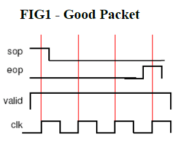
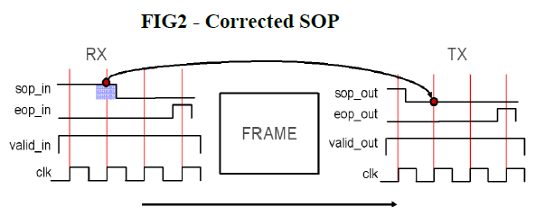
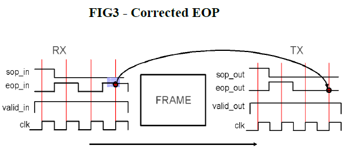
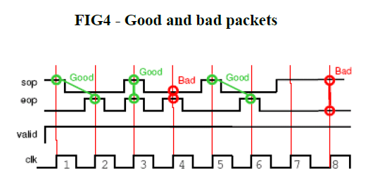
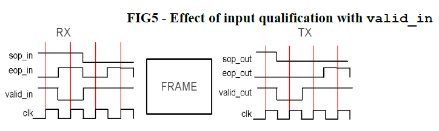
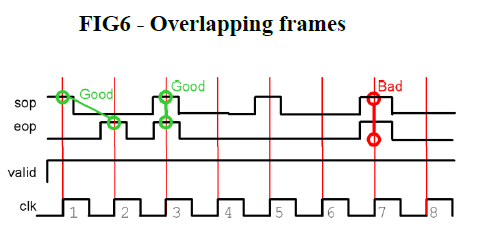
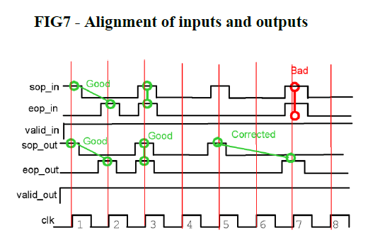

# Formal verification of a data frame protocol

In this repository a simple data frame protocol is formally verified.

Formal verification employs mathematical analysis to explore the entire space of
possible simulations. Properties are defined to specify the design behavior, and
assertions are used to instruct the formal tool to verify that these properties
always hold true.

# HDL

The purpose of the frame module is to output packets with the correct framing.

The module may receive packets with framing errors (corrupt packets), but it
should not output those errors. Instead, it needs to output corrected
packets and ignore all input conditions that do not adhere to the framing
protocol.

## Framing protocol

A packet consists of 3 signals:
1. Start Of Packet (SOP): It is asserted for 1 clock cycle to mark the start of
a packet.
2. End Of Packet (EOP) It is asserted for 1 clock cycle to mark the end of a
packet.
3. Valid: When asserted, it indicates that the SOP and EOP signals are valid.
It can be deasserted at any time. When deasserted, the SOP or EOP signals are
ignored and masked by the framing protocol. THe valid signal must pass straight
through the `frame` module.

When the reset is active i.e '0, the SOP and EOP signals should be deasserted.

A frame can be from 1 to an infinite number of clock cycles long. i.e SOP and
EOP can be asserted in the same clock cycle or spaced an infinite number of
clock cycles apart.

The framing protocol should correct any framing error. That is;
- Two SOPs without an EOP between them.
- An EOP without a corresponding SOP.

Below are various examples:









## TB

`frameTb.sv` is the top level Tb module. The module instances the DUT and
`frameAssertions.sv` which contains the properties and assertions. The top level
Tb drives the inputs of both submodules and connects the output of the DUT to
the respective inputs of `frameAssertions.sv`.

`frameAssertions.sv` contains ONLY synthesizable auxillary logic i.e does not
contain implication operators or time delays.

Note: Properties were written in this manner as Verilator has limited support
for the `property` keyword. However, they can be replaced to the widely used
method eg -

```
property <prop_propertyName>
  @(posedge i_clk) <assert_aseertionName>
endproperty

assert property(<prop_propertyName>);
```

# Makefile

Prerequisites: Verilator, JasperGold FPV

Lint TB and design: `make lint`

Formally verify assertions: `make formal` (all assertions should pass).
